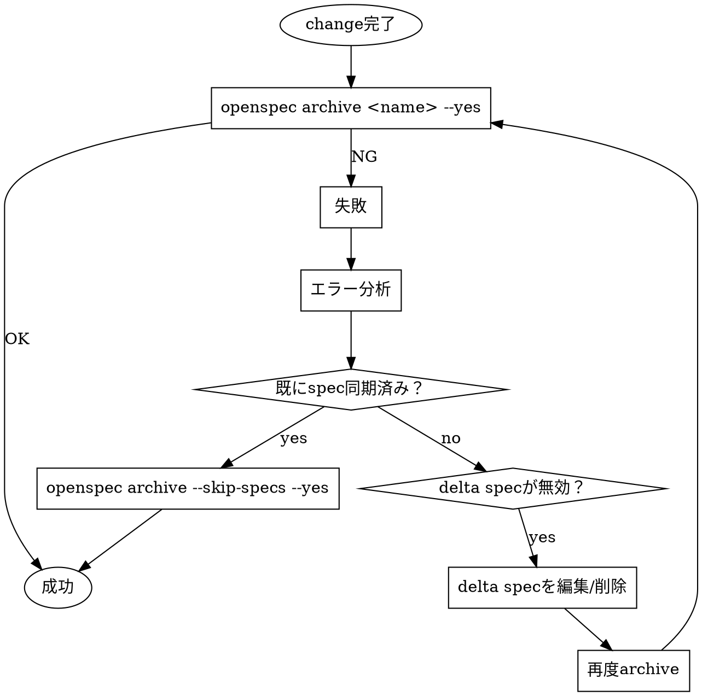

# OpenSpec Workflow

## Overview

OpenSpecはspec-drivenな開発を支援するツール。**手動操作は禁止**。必ずOpenSpecコマンドを使う。

## Core Principle

```
OpenSpecコマンドを使え。手動でファイルを移動/削除するな。
```

## When to Use

- changeをアーカイブしたい
- `openspec archive`が失敗した
- delta specを修正したい
- specを同期したい

## 基本フロー



## Archive失敗パターンと対処

| エラー | 原因 | 対処 |
|--------|------|------|
| `MODIFIED failed - not found` | main specが既に変更済み | 1. git logで確認 2. 既sync済みなら`--skip-specs` 3. delta spec無効なら削除 |
| `REMOVED failed - not found` | 削除対象が既に存在しない | `--skip-specs`でarchive |
| Task status not complete | タスク未完了 | tasks.mdを更新してから再実行 |

## 時系列チェック（重要）

Archive失敗時は**必ずgit履歴を確認**：

```bash
# 関連するOpenSpecファイルの変更履歴
git log --oneline -- "openspec/changes/<name>/" "openspec/specs/<spec-name>/"
```

**チェックポイント**:
1. このchangeより**後に**main specが変更されていないか？
2. 別のchangeで既にsync済みではないか？
3. delta specが作成時点で既に古くなっていないか？

## delta spec編集が必要な場合

delta specの内容がmain specと不一致の場合、**Editツールで修正**する：

```markdown
# 正当な修正パターン
- MODIFIED/REMOVEDセクションを削除（既に反映済みの場合）
- ヘッダーをmain specと一致させる
- 無効なdelta specディレクトリを削除（mv ~/.Trash/）
```

**これは「手動操作」ではなく「delta specの正当な編集」**

## Red Flags - 絶対やるな

- `mv openspec/changes/<name> openspec/archive/` ← 手動アーカイブ禁止
- main specを直接編集してからの`--skip-specs` ← やむを得ない場合のみ
- OpenSpec確認なしでファイル削除

## コマンドリファレンス

```bash
# 通常アーカイブ
openspec archive <name> --yes

# spec同期済みの場合
openspec archive <name> --skip-specs --yes

# spec同期のみ（archiveしない）
openspec sync <name>

# 状態確認
openspec list
openspec status <name>
```

## 今回学んだ教訓

1. **時系列が全て**: changeの作成日時とmain specの変更日時を必ず確認
2. **既sync済みなら`--skip-specs`**: spec同期が過去に行われていればスキップ可能
3. **delta spec編集は正当**: OpenSpecコマンドにdelta編集機能がないため、手動編集は許容
4. **git commitしてから操作**: 変更を保存してから大きな操作をする
