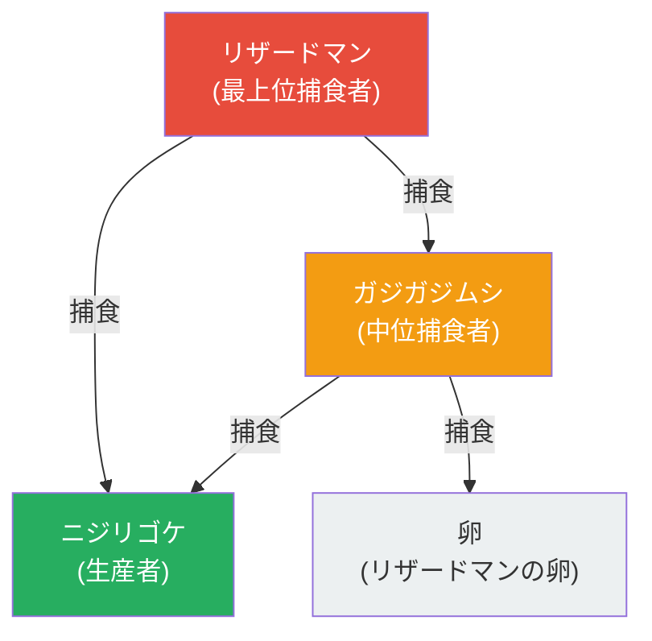

# yn-game

> 2D 生態系シミュレーション × タワーディフェンスのプロトタイプ

**Status: Archived** — `v0.6.1` で個人開発を終了しました。Issue / PR の対応はありません。

## 概要

プレイヤーは魔王軍側として地下王国を防衛するゲームです。地下に住むモンスターは「捕食」「養分流通」「フェーズ遷移」によって相互依存する自律的な生態系を形成し、上から侵攻してくる勇者を迎撃します。

- 基礎生産者の **ニジリゴケ** が土壌から養分を吸収し、繁殖する
- 中位捕食者の **ガジガジムシ** がニジリゴケを食べ、屈折移動で索敵する
- 最上位捕食者の **リザードマン** が定点に巣を築き、産卵する
- グリッド全体で養分総量が保存され、種が均衡を失えば食物連鎖が崩壊する
- タイムリミット後に侵攻する **勇者** を撃退できなければゲームオーバー

<!-- ## スクリーンショット

TODO: docs/screenshots/main.png に画像を配置したら以下のコメントを解除


3 種のモンスターが養分を循環させながら共存している様子。
-->

## 食物連鎖



養分の流れ・ライフサイクル・勇者AI など、より詳しい図解は [`docs/diagrams/`](docs/diagrams/) を参照してください。

## 特徴

- **3 種の食物連鎖**: ニジリゴケ → ガジガジムシ → リザードマン
- **養分保存則**: グリッド全体で養分総量が保存される（勇者死亡時のみ例外）
- **フェーズ遷移によるライフサイクル**: 各モンスターが自動で進化（mobile → bud → flower など）
- **3 種の移動パターン**: 直進 / 屈折 / 定点営巣
- **勇者 AI**: タイムリミット後に侵攻、撃退できなければゲームオーバー
- **TDD 駆動開発**: 単体・統合・E2E（Playwright）の 3 層テスト

## 技術スタック

| 領域 | 採用技術 |
|------|---------|
| フロントエンド | Vue 3 / Vite / TypeScript |
| テスト | Vitest / Playwright / @vue/test-utils |
| 品質 | ESLint / Prettier |
| 実行環境 | Docker Compose / Node.js 20 / pnpm |

詳細なバージョンは [`package.json`](./package.json) を参照してください。

## はじめに

前提: Docker / Docker Compose

```bash
docker compose up
```

ブラウザで `http://localhost:5173/yn-game/` を開くとゲームが起動します。

開発時の依存はすべて Docker コンテナ内に格納される方針のため、ローカルに `node_modules` を置く必要はありません。

## 開発コマンド

```bash
# 開発サーバー
docker compose up

# ユニットテスト
docker compose run --rm app pnpm test

# E2E テスト（Playwright）
docker compose --profile e2e run --rm e2e

# 型チェック
docker compose run --rm app pnpm exec vue-tsc -b

# Lint
docker compose run --rm app pnpm lint
```

ワークフロー（OpenSpec、Git Worktree など）の詳細は [`CLAUDE.md`](./CLAUDE.md) を参照してください。

## アーキテクチャ概要

```
src/
├── core/           UI 非依存のゲームロジック
│   ├── simulation.ts     ティック単位のメインループ
│   ├── predation.ts      捕食システム
│   ├── nutrient.ts       養分システム
│   ├── movement/         移動パターン（直進・屈折・定点営巣）
│   └── hero/             勇者システム
├── components/     Vue コンポーネント
└── scenarios/      シナリオ定義（捕食チェーン、変態など）
```

設計思想・SSoT・ファイル肥大化閾値などの開発ルールは [`CLAUDE.md`](./CLAUDE.md) と [`.claude/rules/`](.claude/rules/) を参照してください。

## ドキュメント

- [`docs/diagrams/`](docs/diagrams/) — ゲームメカニクスの Mermaid 図（食物連鎖・養分循環・ライフサイクル・勇者システム・ゲームループ）
- [`openspec/specs/`](openspec/specs/) — 仕様書（30 件以上）
- [`CLAUDE.md`](./CLAUDE.md) — 開発運用ドキュメント

## ライセンス

[MIT License](./LICENSE) © 2026 padawansato
