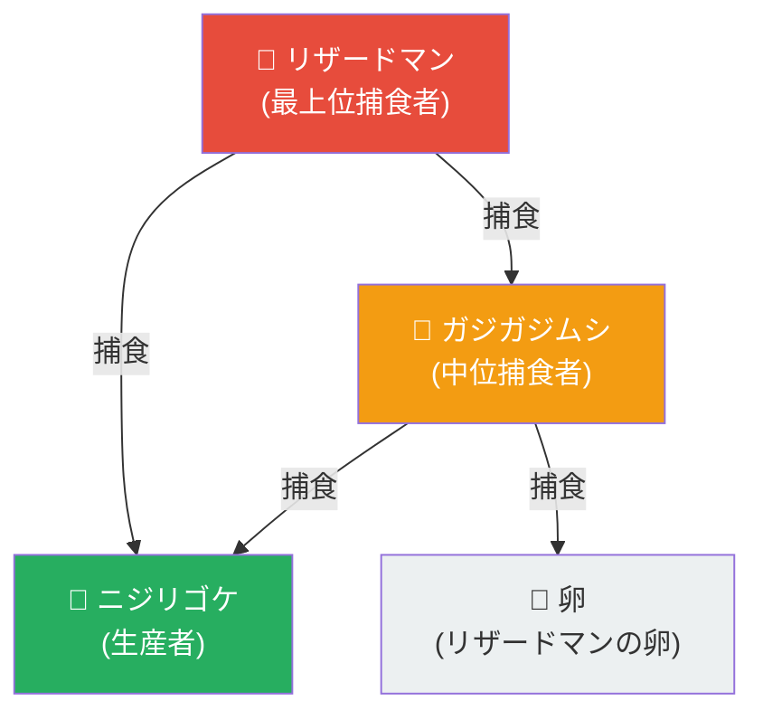
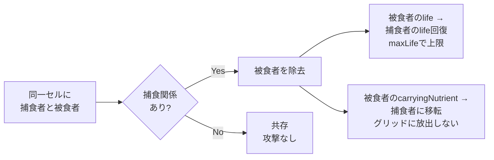

<!-- Based on: v0.4.2 -->
# 食物連鎖

## 捕食関係

## 捕食メカニクス

## 捕食可能マトリクス

| 捕食者 ＼ 被食者 | ニジリゴケ | ガジガジムシ | リザードマン | 卵 |
|:---:|:---:|:---:|:---:|:---:|
| **リザードマン** | ✅ | ✅ | - | ❌ |
| **ガジガジムシ** | ✅ | - | ❌ | ✅ |
| **ニジリゴケ** | - | ❌ | ❌ | ❌ |

- 不動フェーズ（bud, pupa, egg）のモンスターも捕食対象
- 種族の全滅時に `FOOD_CHAIN_BROKEN` イベント発火
