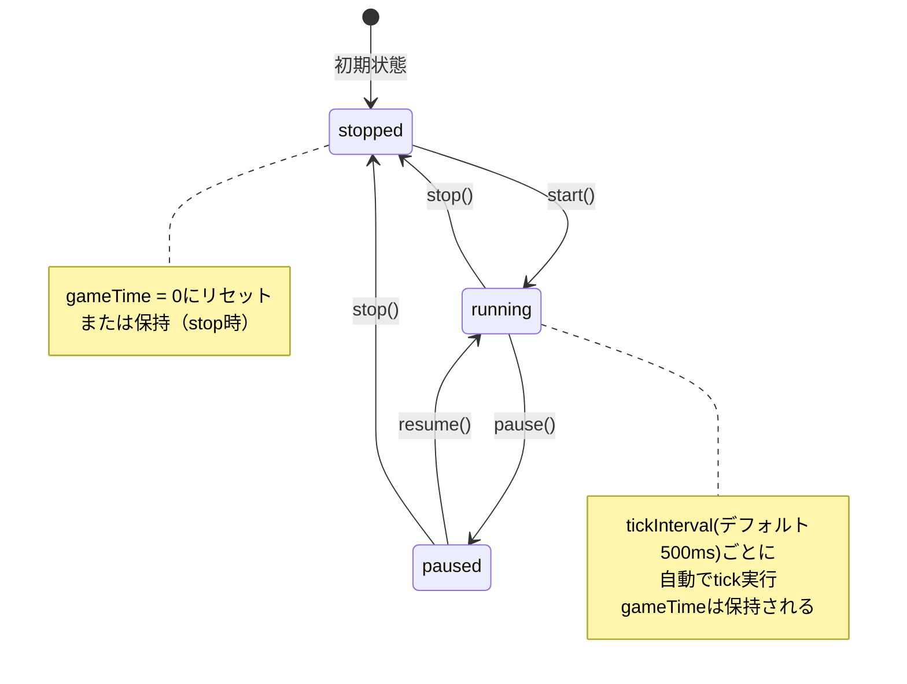
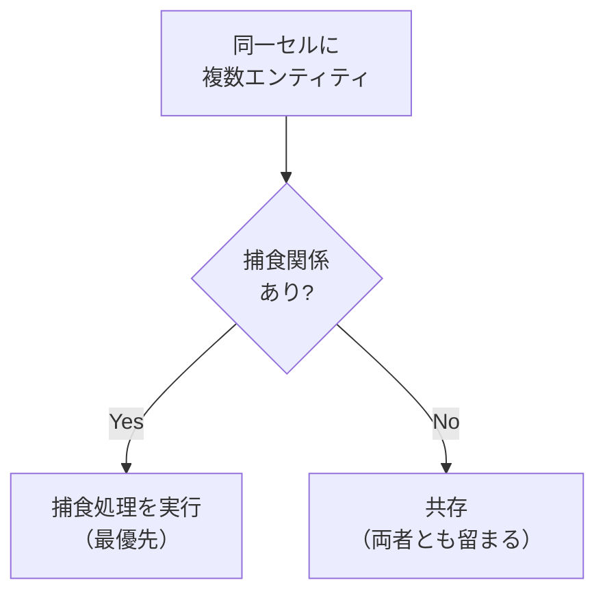

<!-- Based on: v0.4.2 -->
# ゲームループ

## tick内の処理順序

```mermaid
flowchart TD
    TICK_START(["tick開始\ngameTime += 1"])

    subgraph "1. 勇者スポーンチェック"
        H1{"gameTime =\nSPAWN_START - ANNOUNCE?"}
        H1 -->|Yes| H1A["HERO_PARTY_ANNOUNCED\nイベント発火"]
        H1 -->|No| H2
        H2{"スポーンtick\nに到達?"}
        H2 -->|Yes| H2A["入口に勇者生成"]
        H2 -->|No| H3["スキップ"]
    end

    subgraph "2. 移動フェーズ"
        M1["全モンスターの移動を同時計算"]
        M2["不動フェーズはスキップ\n(bud, flower, withered, pupa, laying, egg)"]
        M3["移動パターン適用\nstraight / refraction / nest patrol"]
        M4["空腹時: 獲物方向を優先\n(life < 30% maxLife)"]
    end

    subgraph "3. 養分インタラクション"
        N1["ニジリゴケ: 隣接土壌から養分吸収\n（facing方向優先）"]
        N2["ニジリゴケ: 養分2以上で土壌へ放出"]
        N3["carry capacity確認（最大10）"]
    end

    subgraph "4. ライフコスト"
        L1{"carryingNutrient > 0?"}
        L1 -->|Yes| L2["養分 -1"]
        L1 -->|No| L3["life -1"]
        L3 --> L4{"life ≤ 0?"}
        L4 -->|Yes| L5["死亡 → 養分9セル分配"]
        L4 -->|No| L6["継続"]
        L7["flower: 毎tick life -1"]
        L8["不動フェーズ: ライフコスト免除"]
    end

    subgraph "5. 攻撃フェーズ（同時処理）"
        A1["全エンティティが前方セル確認"]
        A2["ダメージを同時計算・適用"]
        A3{"life ≤ 0?"}
        A3 -->|Yes| A4["死亡処理\n(モンスター: 養分分配)\n(勇者: NUTRIENT_DROP追加)"]
        A3 -->|No| A5["継続"]
    end

    subgraph "6. 特殊フェーズアクション"
        S1["flower: 9セル内ガジガジムシに\nMOYOMOYO_DAMAGE(2)"]
        S2["ガジガジムシ成虫: 繁殖判定"]
        S3["ニジリゴケwithered: 繁殖（最大5体）"]
        S4["リザードマンlaying: 産卵判定"]
        S5["卵: 孵化判定"]
    end

    subgraph "7. フェーズ遷移（最後に実行）"
        P1["全モンスターの遷移条件を評価"]
        P2["遷移を適用"]
        P3["PHASE_TRANSITIONイベント発火"]
    end

    subgraph "8. ポストtickチェック"
        POST1{"勇者が\nreturning状態で\n入口に到達?"}
        POST1 -->|Yes| GAMEOVER["isGameOver = true\nGAME_OVERイベント"]
        POST1 -->|No| POST2
        POST2{"総養分 <\n閾値?"}
        POST2 -->|Yes| DYING["'world dying'\nイベント"]
        POST2 -->|No| POST3
        POST3{"被食種の\n個体数 = 0?"}
        POST3 -->|Yes| BROKEN["FOOD_CHAIN_BROKEN\nイベント"]
        POST3 -->|No| TICK_END
    end

    TICK_START --> H1
    H1A --> M1
    H3 --> M1
    H2A --> M1
    M1 --> M2 --> M3 --> M4
    M4 --> N1 --> N2 --> N3
    N3 --> L1
    L2 --> L7
    L6 --> L7
    L5 --> L7
    L7 --> L8
    L8 --> A1 --> A2 --> A3
    A4 --> S1
    A5 --> S1
    S1 --> S2 --> S3 --> S4 --> S5
    S5 --> P1 --> P2 --> P3
    P3 --> POST1
    DYING --> POST3
    GAMEOVER --> TICK_END

    TICK_END(["tick終了"])
```

## ゲームループ制御

```mermaid
stateDiagram-v2
    [*] --> stopped: 初期状態

    stopped --> running: start()
    running --> paused: pause()
    paused --> running: resume()
    running --> stopped: stop()
    paused --> stopped: stop()

    note right of running
        tickInterval(デフォルト500ms)ごとに
        自動でtick実行
        gameTimeは保持される
    end note

    note right of stopped
        gameTime = 0にリセット
        または保持（stop時）
    end note
```

## 衝突解決の優先順位

```mermaid
flowchart TD
    COLLISION["同一セルに\n複数エンティティ"]
    COLLISION --> PRED{"捕食関係\nあり?"}
    PRED -->|Yes| EAT["捕食処理を実行\n（最優先）"]
    PRED -->|No| COEXIST["共存\n（両者とも留まる）"]
```
