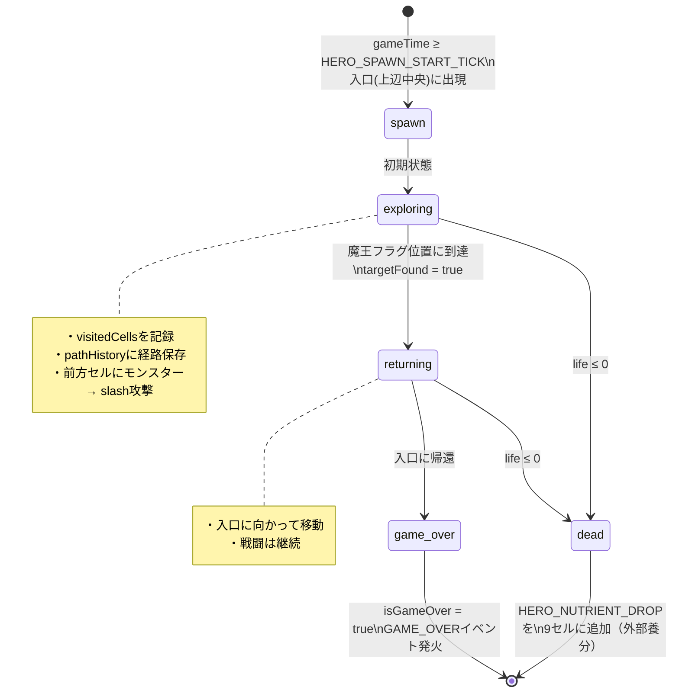
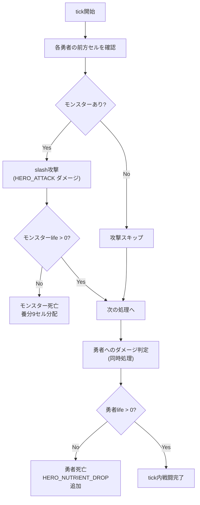
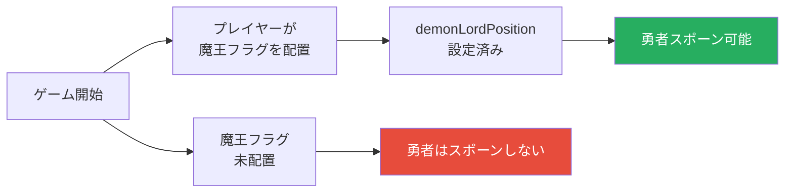

# 勇者システム

## 勇者の状態遷移

```mermaid
stateDiagram-v2
    [*] --> spawn: gameTime ≥ HERO_SPAWN_START_TICK\n入口(上辺中央)に出現

    spawn --> exploring: 初期状態

    exploring --> returning: 魔王フラグ位置に到達\ntargetFound = true
    exploring --> dead: life ≤ 0

    returning --> game_over: 入口に帰還
    returning --> dead: life ≤ 0

    dead --> [*]: HERO_NUTRIENT_DROPを\n9セルに追加（外部養分）

    game_over --> [*]: isGameOver = true\nGAME_OVERイベント発火

    note right of exploring
        ・visitedCellsを記録
        ・pathHistoryに経路保存
        ・前方セルにモンスター → slash攻撃
    end note

    note right of returning
        ・入口に向かって移動
        ・戦闘は継続
    end note
```

## 勇者スポーンのタイムライン

```mermaid
gantt
    title 勇者パーティのスポーン順序
    dateFormat X
    axisFormat %s tick

    section イベント
    HERO_PARTY_ANNOUNCED       :milestone, m1, 0, 0

    section 勇者スポーン
    Hero 1 (探索開始)          :h1, 1, 2
    Hero 2                     :h2, 3, 4
    Hero 3                     :h3, 5, 6
```

> **注**: 実際のtick値は `HERO_SPAWN_START_TICK`, `HERO_ANNOUNCE_TICKS`, `HERO_SPAWN_INTERVAL` で決定。
> 上図は相対的な順序を示す概念図。

## 戦闘フロー

```mermaid
flowchart TD
    TICK["tick開始"]
    TICK --> HERO_CHECK["各勇者の前方セルを確認"]
    HERO_CHECK --> HAS_ENEMY{モンスターあり?}
    HAS_ENEMY -->|Yes| SLASH["slash攻撃\n(HERO_ATTACK ダメージ)"]
    HAS_ENEMY -->|No| SKIP["攻撃スキップ"]
    SLASH --> MONSTER_ALIVE{モンスターlife > 0?}
    MONSTER_ALIVE -->|No| MONSTER_DIES["モンスター死亡\n養分9セル分配"]
    MONSTER_ALIVE -->|Yes| NEXT["次の処理へ"]
    SKIP --> NEXT

    NEXT --> HERO_DMG["勇者へのダメージ判定\n(同時処理)"]
    HERO_DMG --> HERO_ALIVE{勇者life > 0?}
    HERO_ALIVE -->|No| HERO_DIES["勇者死亡\nHERO_NUTRIENT_DROP追加"]
    HERO_ALIVE -->|Yes| DONE["tick内戦闘完了"]
```

## ゲーム開始前の準備

```mermaid
flowchart LR
    START["ゲーム開始"]
    START --> PLACE_DL["プレイヤーが\n魔王フラグを配置"]
    PLACE_DL --> DL_SET["demonLordPosition\n設定済み"]
    DL_SET --> HERO_SPAWN["勇者スポーン可能"]

    START --> NO_DL["魔王フラグ\n未配置"]
    NO_DL --> NO_HERO["勇者はスポーンしない"]

    style NO_HERO fill:#e74c3c,color:#fff
    style HERO_SPAWN fill:#27ae60,color:#fff
```
