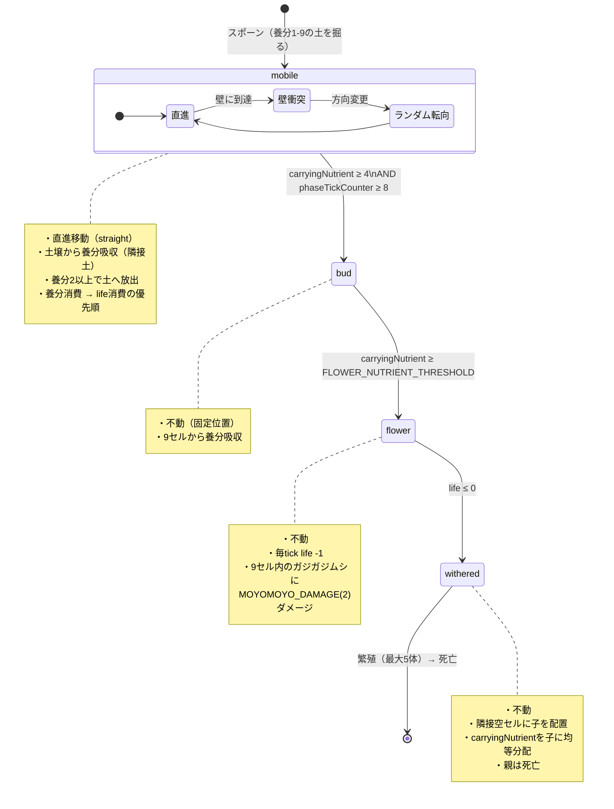
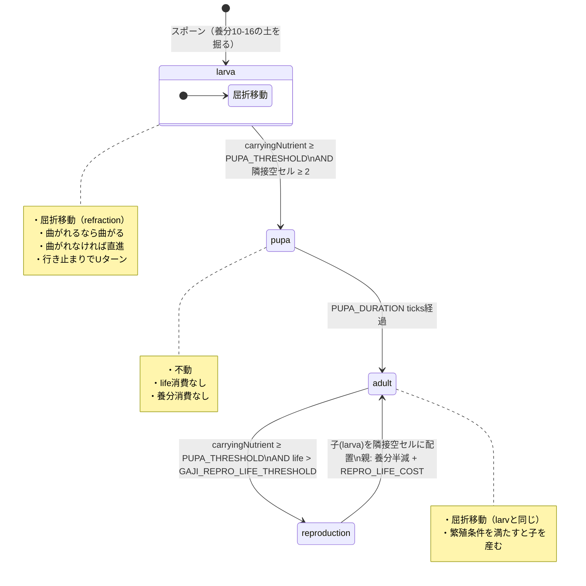
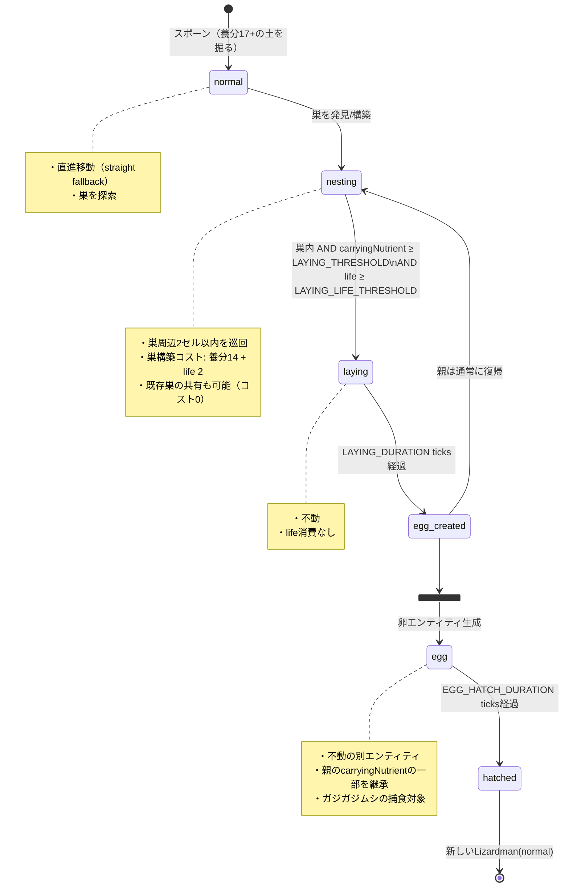

# モンスターライフサイクル

## ニジリゴケ（Nijirigoke）

移動型 → 固着 → 開花 → 枯死・繁殖のサイクル。

```mermaid
stateDiagram-v2
    [*] --> mobile: スポーン（養分1-9の土を掘る）

    mobile --> bud: carryingNutrient ≥ 4\nAND phaseTickCounter ≥ 8
    bud --> flower: carryingNutrient ≥ FLOWER_NUTRIENT_THRESHOLD
    flower --> withered: life ≤ 0
    withered --> [*]: 繁殖（最大5体）→ 死亡

    state mobile {
        direction LR
        [*] --> 直進
        直進 --> 壁衝突: 壁に到達
        壁衝突 --> ランダム転向: 方向変更
        ランダム転向 --> 直進
    }

    note right of mobile
        ・直進移動（straight）
        ・土壌から養分吸収（隣接土）
        ・養分2以上で土へ放出
        ・養分消費 → life消費の優先順
    end note

    note right of bud
        ・不動（固定位置）
        ・9セルから養分吸収
    end note

    note right of flower
        ・不動
        ・毎tick life -1
        ・9セル内のガジガジムシに
          MOYOMOYO_DAMAGE(2)ダメージ
    end note

    note right of withered
        ・不動
        ・隣接空セルに子を配置
        ・carryingNutrientを子に均等分配
        ・親は死亡
    end note
```

## ガジガジムシ（Gajigajimushi）

幼虫 → 蛹 → 成虫のサイクル。成虫は繁殖可能。

```mermaid
stateDiagram-v2
    [*] --> larva: スポーン（養分10-16の土を掘る）

    larva --> pupa: carryingNutrient ≥ PUPA_THRESHOLD\nAND 隣接空セル ≥ 2
    pupa --> adult: PUPA_DURATION ticks経過
    adult --> reproduction: carryingNutrient ≥ PUPA_THRESHOLD\nAND life > GAJI_REPRO_LIFE_THRESHOLD
    reproduction --> adult: 子(larva)を隣接空セルに配置\n親: 養分半減 + REPRO_LIFE_COST

    state larva {
        direction LR
        [*] --> 屈折移動
    }

    note right of larva
        ・屈折移動（refraction）
        ・曲がれるなら曲がる
        ・曲がれなければ直進
        ・行き止まりでUターン
    end note

    note right of pupa
        ・不動
        ・life消費なし
        ・養分消費なし
    end note

    note right of adult
        ・屈折移動（larvと同じ）
        ・繁殖条件を満たすと子を産む
    end note
```

## リザードマン（Lizardman）

巣を構え、産卵・孵化で繁殖する。

```mermaid
stateDiagram-v2
    [*] --> normal: スポーン（養分17+の土を掘る）

    normal --> nesting: 巣を発見/構築
    nesting --> laying: 巣内 AND carryingNutrient ≥ LAYING_THRESHOLD\nAND life ≥ LAYING_LIFE_THRESHOLD
    laying --> egg_created: LAYING_DURATION ticks経過
    egg_created --> nesting: 親は通常に復帰

    state egg_phase <<fork>>
    egg_created --> egg_phase
    egg_phase --> egg: 卵エンティティ生成
    egg --> hatched: EGG_HATCH_DURATION ticks経過
    hatched --> [*]: 新しいLizardman(normal)

    note right of normal
        ・直進移動（straight fallback）
        ・巣を探索
    end note

    note right of nesting
        ・巣周辺2セル以内を巡回
        ・巣構築コスト: 養分14 + life 2
        ・既存巣の共有も可能（コスト0）
    end note

    note right of laying
        ・不動
        ・life消費なし
    end note

    note right of egg
        ・不動の別エンティティ
        ・親のcarryingNutrientの一部を継承
        ・ガジガジムシの捕食対象
    end note
```
