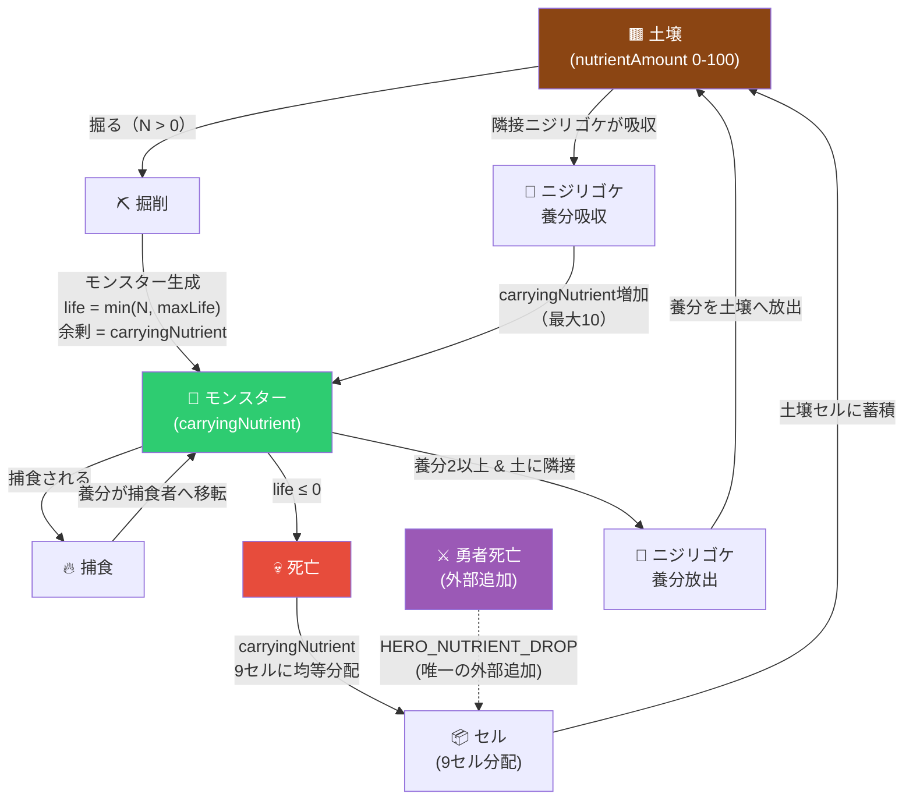
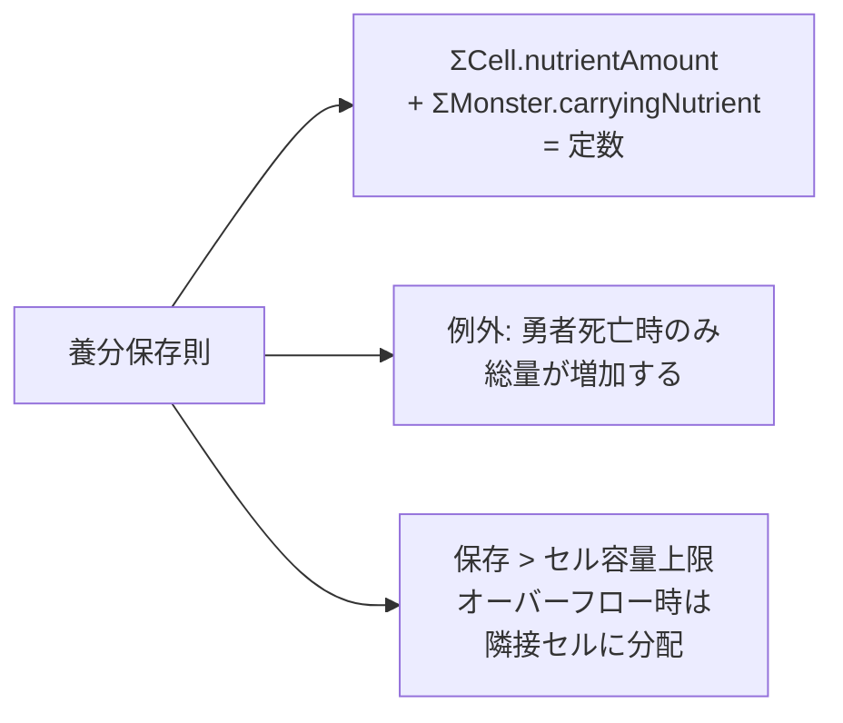
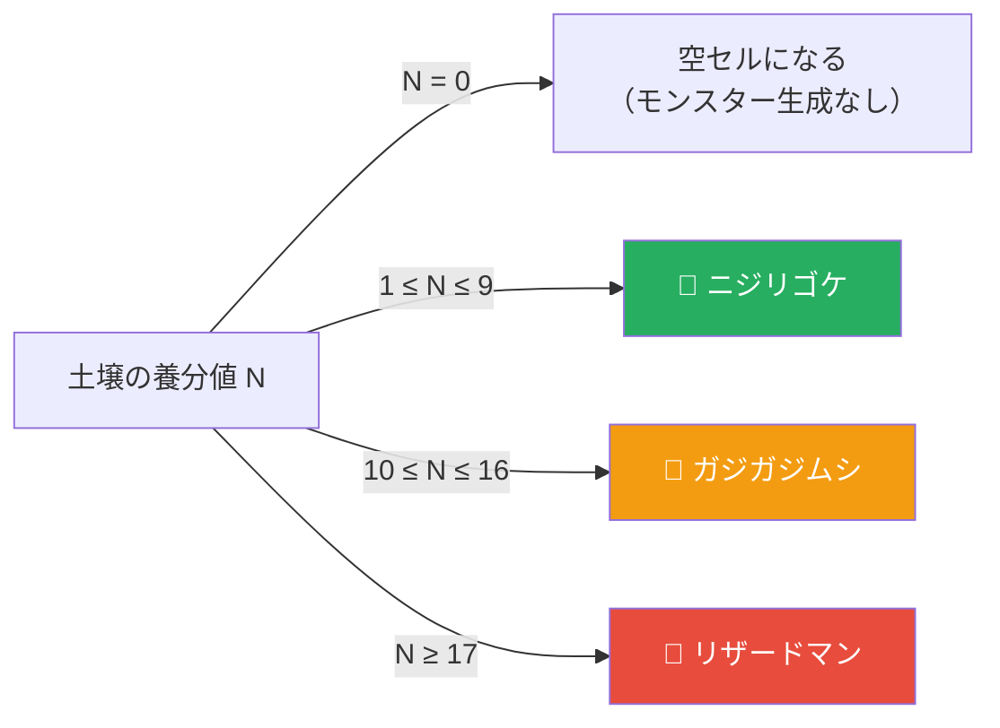
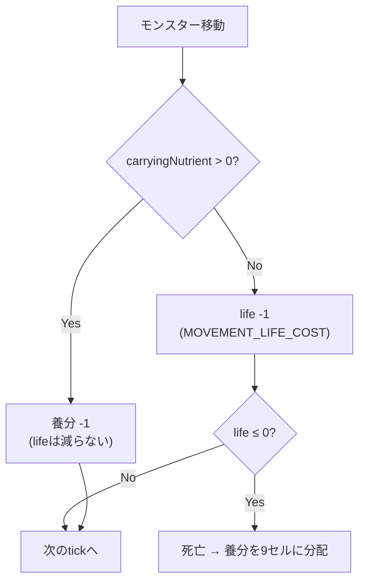

<!-- Based on: v0.4.2 -->
# 養分フロー

## 養分循環の全体像

```mermaid
flowchart TD
    SOIL["🟫 土壌\n(nutrientAmount 0-100)"]
    DIG["⛏️ 掘削"]
    MONSTER["👾 モンスター\n(carryingNutrient)"]
    PREDATION["🔥 捕食"]
    DEATH["💀 死亡"]
    CELLS["📦 セル\n(9セル分配)"]
    HERO_DEATH["⚔️ 勇者死亡\n(外部追加)"]
    ABSORB["🌿 ニジリゴケ\n養分吸収"]
    RELEASE["🌿 ニジリゴケ\n養分放出"]

    SOIL -->|"掘る（N > 0）"| DIG
    DIG -->|"モンスター生成\nlife = min(N, maxLife)\n余剰 = carryingNutrient"| MONSTER
    MONSTER -->|"捕食される"| PREDATION
    PREDATION -->|"養分が捕食者へ移転"| MONSTER
    MONSTER -->|"life ≤ 0"| DEATH
    DEATH -->|"carryingNutrient\n9セルに均等分配"| CELLS
    CELLS -->|"土壌セルに蓄積"| SOIL
    SOIL -->|"隣接ニジリゴケが吸収"| ABSORB
    ABSORB -->|"carryingNutrient増加\n（最大10）"| MONSTER
    MONSTER -->|"養分2以上 & 土に隣接"| RELEASE
    RELEASE -->|"養分を土壌へ放出"| SOIL
    HERO_DEATH -.->|"HERO_NUTRIENT_DROP\n(唯一の外部追加)"| CELLS

    style HERO_DEATH fill:#9b59b6,color:#fff
    style SOIL fill:#8B4513,color:#fff
    style MONSTER fill:#2ecc71,color:#fff
    style DEATH fill:#e74c3c,color:#fff
```

## 養分保存則

```mermaid
flowchart LR
    LAW["養分保存則"]
    LAW --> EQ["ΣCell.nutrientAmount\n+ ΣMonster.carryingNutrient\n= 定数"]
    LAW --> EXCEPT["例外: 勇者死亡時のみ\n総量が増加する"]
    LAW --> PRIORITY["保存 > セル容量上限\nオーバーフロー時は\n隣接セルに分配"]
```

## スポーン時の養分閾値

```mermaid
flowchart LR
    N["土壌の養分値 N"]
    N -->|"N = 0"| EMPTY["空セルになる\n（モンスター生成なし）"]
    N -->|"1 ≤ N ≤ 9"| NJ["🌿 ニジリゴケ"]
    N -->|"10 ≤ N ≤ 16"| GJ["🐛 ガジガジムシ"]
    N -->|"N ≥ 17"| LZ["🦎 リザードマン"]

    style NJ fill:#27ae60,color:#fff
    style GJ fill:#f39c12,color:#fff
    style LZ fill:#e74c3c,color:#fff
```

## 移動時の養分/life消費

```mermaid
flowchart TD
    MOVE["モンスター移動"]
    MOVE --> CHECK{carryingNutrient > 0?}
    CHECK -->|Yes| NUTRIENT["養分 -1\n(lifeは減らない)"]
    CHECK -->|No| LIFE["life -1\n(MOVEMENT_LIFE_COST)"]
    LIFE --> DEATH_CHECK{life ≤ 0?}
    DEATH_CHECK -->|Yes| DIE["死亡 → 養分を9セルに分配"]
    DEATH_CHECK -->|No| CONTINUE["次のtickへ"]
    NUTRIENT --> CONTINUE
```
